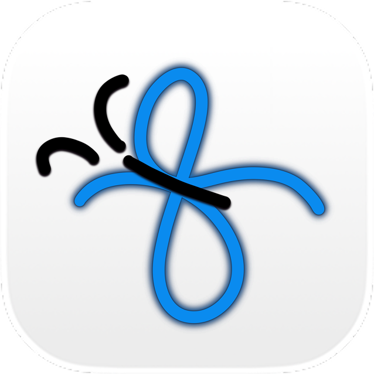

> SWE • Full-Stack Dev • Researcher • AI/ML Enthusiast

Building impactful products and exploring new tech, from hackathons to coffee-fueled ideas. ⋆ ☕︎ྀི ˖

<!-- #### TECH STACK -->
       

<!-- #### QUICK LINKS -->
[Web](https://aureliasindhu.com/) • [LinkedIn](https://www.linkedin.com/in/aurelia-sindhunirmala/) • [Devpost](https://devpost.com/AureliaSindhu)

<!--  -->

<picture>
  <source media="(prefers-color-scheme: dark)" srcset="favicon-dark.png">
  <source media="(prefers-color-scheme: light)" srcset="favicon-light.png">
  
</picture>